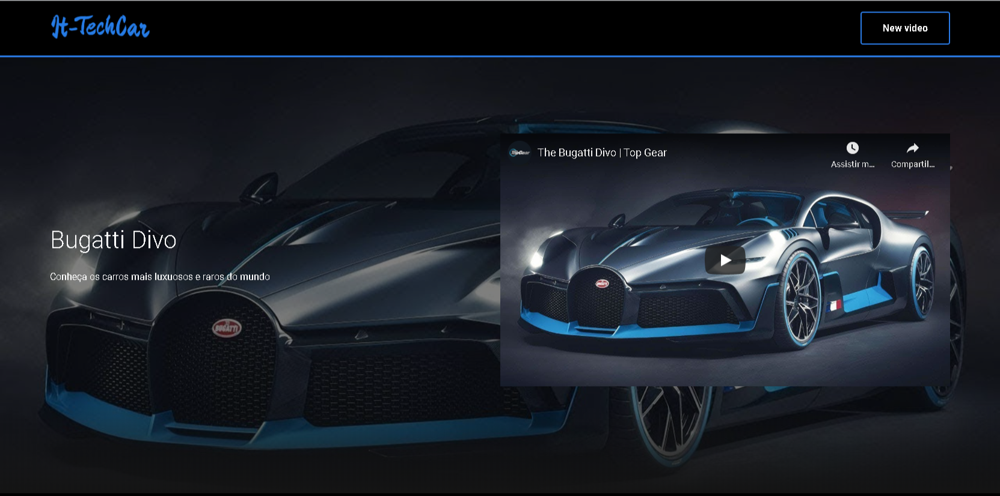
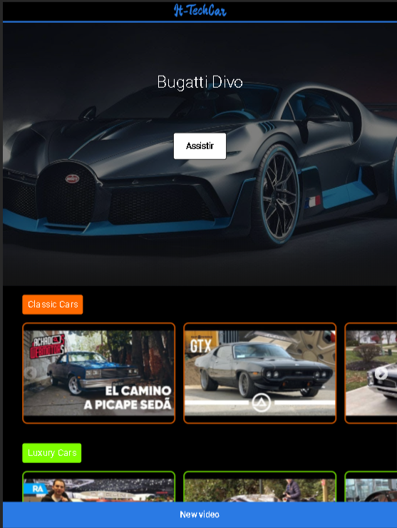
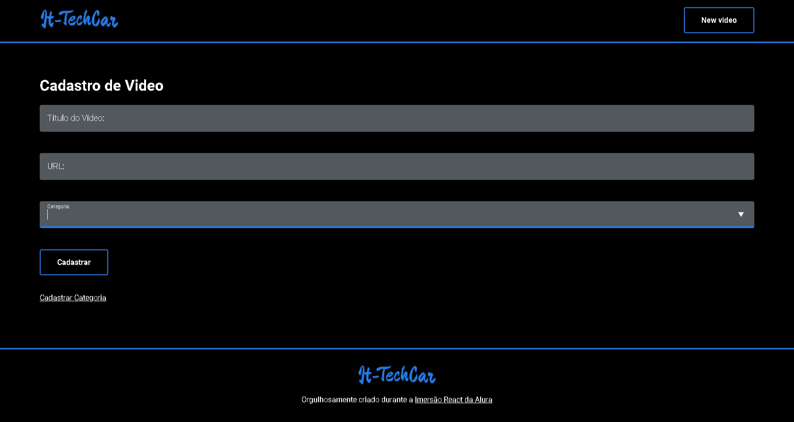
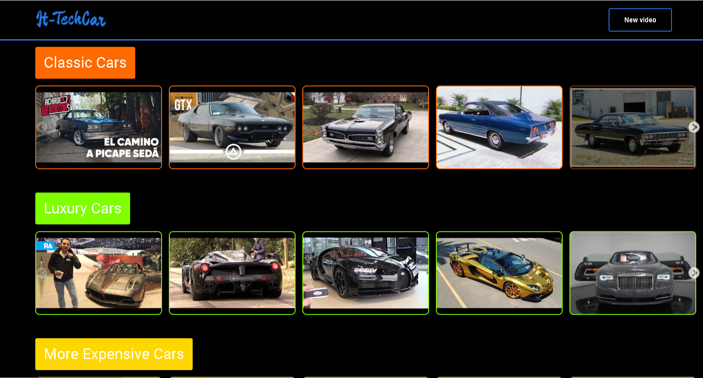

<h1 align="left">
  It-TechCar | Repositório de vídeos
</h1>

<h3 align="left">Resumo:</h3>
<p align="left">Projeto criado durante a #ImersãoReact da Alura, que consiste-se em um acervo de vídeos do YouTube escolhidos pelo usuário. Criei o It-TechCar, uma coletânea de vídeos de Carros.</p>


<h3 align="left">Recursos utilizados:</h3>
<p align="left">Além do ReactJS, utilizamos JavaScript, Styled Components, CSS, React Slick, React Router Dom, Prop Types, JSON Server e Node.js.</p>


## Em Aprimoramento
> Projeto construido durante a [Imersão React da Alura](https://www.alura.com.br/imersao-react/) 

## 👨🏼‍💻 Desenvolvedor 

- [Ítalo Henrique](https://www.linkedin.com/in/italo-tech/)

## :rocket: Tecnologias e Libs

Esse projeto foi desenvolvido com as seguintes tecnologias e Libs:

- [JavaScript](https://www.javascript.com/)
- [React](https://reactjs.org)
- [React Slick](https://react-slick.neostack.com/)
- [React Router Dom](https://reactrouter.com/)
- [Prop Types](https://pt-br.reactjs.org/docs/typechecking-with-proptypes.html)
- [JSON ](https://www.npmjs.com/package/json-server)
- [Node.js](https://nodejs.org/en/)
- [StyleComponents](https://styled-components.com/)
- [CSS](https://developer.mozilla.org/pt-BR/docs/Web/CSS)

<h3 align="left">Responsividade:</h3>
<p align="left">O projeto foi estilizado para se adequar a dispositivos móveis, mantendo seu aspecto original e ajustando alguns pontos, como o link 'Novo Vídeo', a fim de garantir uma boa experiência ao usuário.</p>

<p align="center">
 


</p>

## Como rodar o projeto?

Após baixar o projeto, acesse ele via seu terminal rode os comandos:

```sh
npm install
npm start (para executar react-scripts start)
npm dev - (para executar npm run server)
```

<h1>Agradecimentos:</h1>
<p>Paulo Silveira, Mario Souto, Marco Bruno, Juliana Negreiros e toda equipe Alura envolvida nesse evento maravilhoso.</p>
